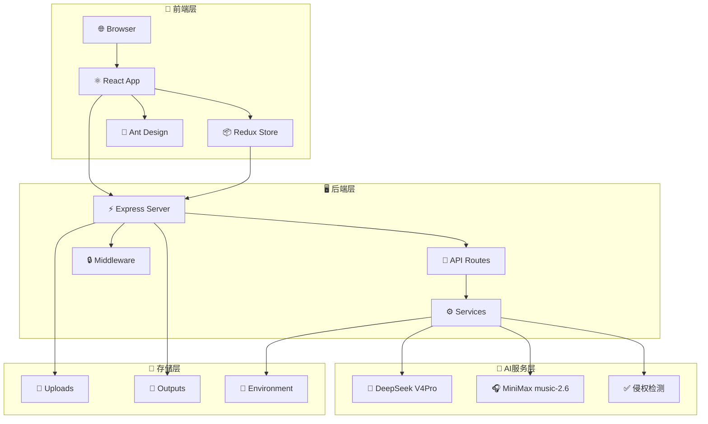
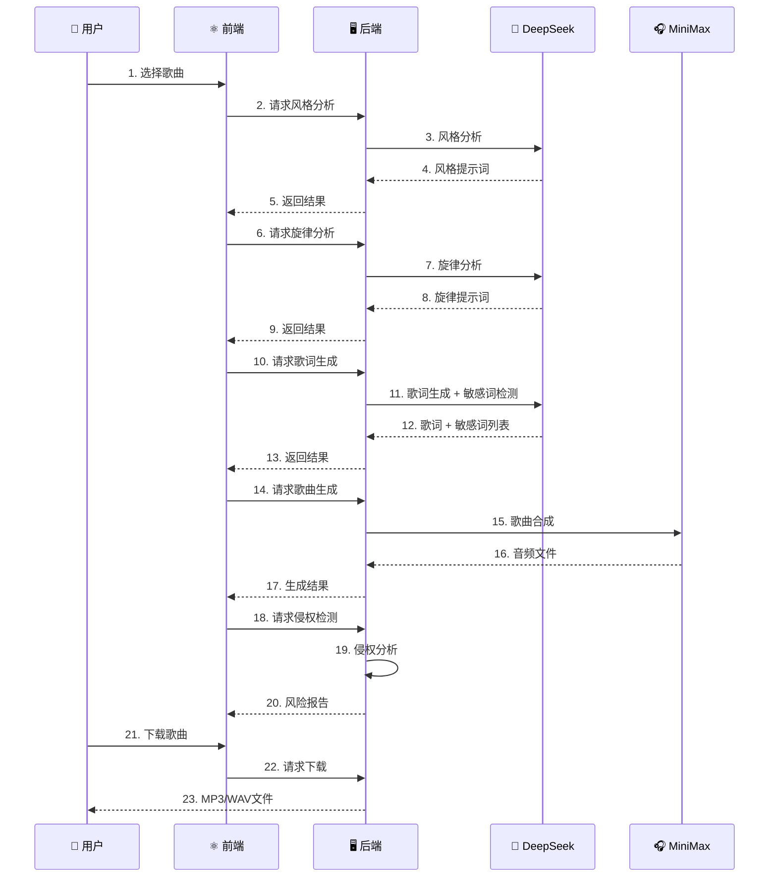
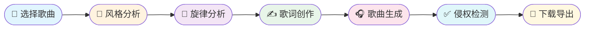
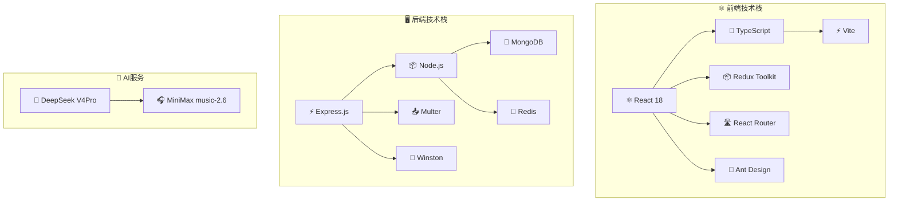
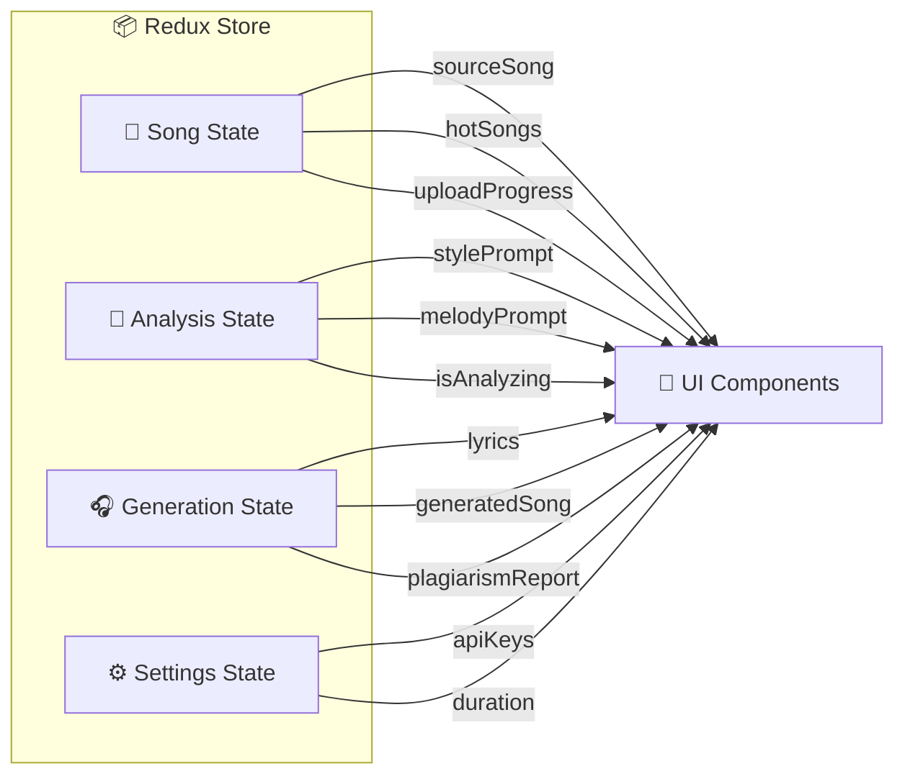
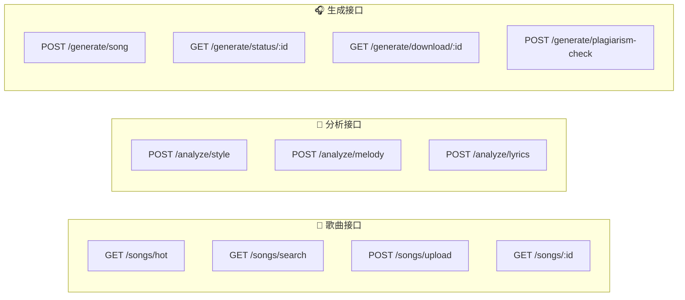
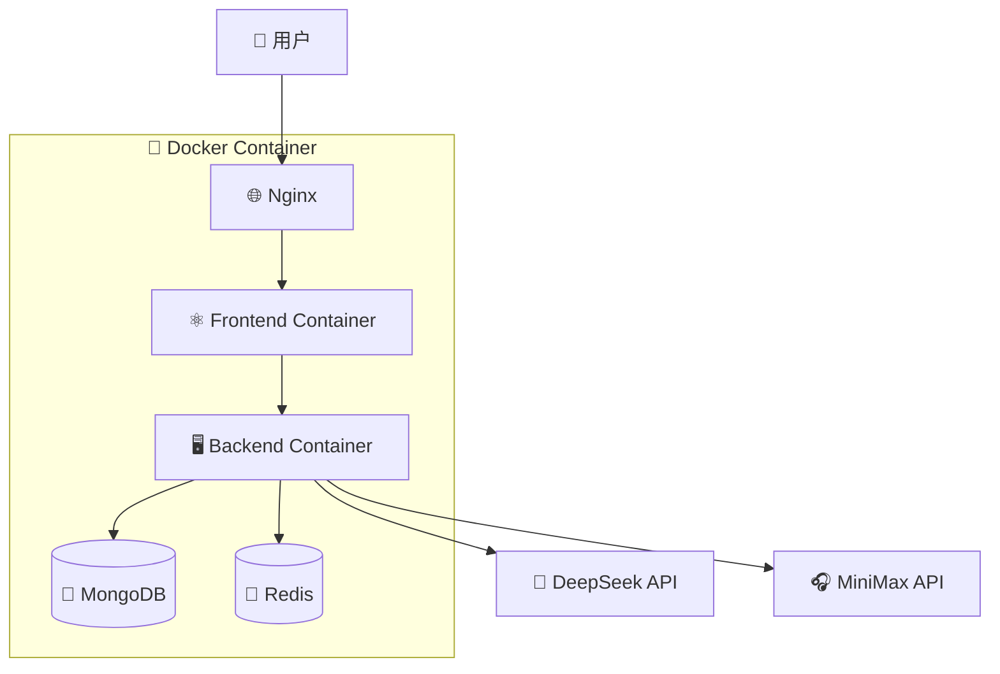

# AI Song Generator - 架构图示

## 系统架构图

```mermaid
graph TB
    subgraph Client["🎨 前端层"]
        Browser[🌐 Browser]
        React[⚛️ React App]
        Redux[📦 Redux Store]
        AntDesign[🎨 Ant Design]
    end

    subgraph Server["🖥️ 后端层"]
        Express[⚡ Express Server]
        Routes[📍 API Routes]
        Middleware[🔒 Middleware]
        Services[⚙️ Services]
    end

    subgraph AI["🤖 AI服务层"]
        DeepSeek[🎯 DeepSeek V4Pro]
        MiniMax[🎧 MiniMax music-2.6]
        Plagiarism[✅ 侵权检测]
    end

    subgraph Storage["💾 存储层"]
        Uploads[📁 Uploads]
        Outputs[📁 Outputs]
        Env[🔐 Environment]
    end

    Browser --> React
    React --> Redux
    React --> AntDesign
    React --> Express
    Redux --> Express

    Express --> Routes
    Express --> Middleware
    Routes --> Services

    Services --> DeepSeek
    Services --> MiniMax
    Services --> Plagiarism

    Express --> Uploads
    Express --> Outputs
    Services --> Env
```

## 数据流图

```mermaid
sequenceDiagram
    participant User as 👤 用户
    participant Frontend as ⚛️ 前端
    participant Backend as 🖥️ 后端
    participant DeepSeek as 🎯 DeepSeek
    participant MiniMax as 🎧 MiniMax

    User->>Frontend: 1. 选择歌曲
    Frontend->>Backend: 2. 请求风格分析
    Backend->>DeepSeek: 3. 风格分析
    DeepSeek-->>Backend: 4. 风格提示词
    Backend-->>Frontend: 5. 返回结果

    Frontend->>Backend: 6. 请求旋律分析
    Backend->>DeepSeek: 7. 旋律分析
    DeepSeek-->>Backend: 8. 旋律提示词
    Backend-->>Frontend: 9. 返回结果

    Frontend->>Backend: 10. 请求歌词生成
    Backend->>DeepSeek: 11. 歌词生成 + 敏感词检测
    DeepSeek-->>Backend: 12. 歌词 + 敏感词列表
    Backend-->>Frontend: 13. 返回结果

    Frontend->>Backend: 14. 请求歌曲生成
    Backend->>MiniMax: 15. 歌曲合成
    MiniMax-->>Backend: 16. 音频文件
    Backend-->>Frontend: 17. 生成结果

    Frontend->>Backend: 18. 请求侵权检测
    Backend->>Backend: 19. 侵权分析
    Backend-->>Frontend: 20. 风险报告

    User->>Frontend: 21. 下载歌曲
    Frontend->>Backend: 22. 请求下载
    Backend-->>User: 23. MP3/WAV文件
```

## 创作流程图

```mermaid
graph LR
    A([🎵 选择歌曲]) --> B([🎯 风格分析])
    B --> C([🎼 旋律分析])
    C --> D([✍️ 歌词创作])
    D --> E([🎧 歌曲生成])
    E --> F([✅ 侵权检测])
    F --> G([💾 下载导出])

    style A fill:#e1f5fe
    style B fill:#fff3e0
    style C fill:#f3e5f5
    style D fill:#e8f5e9
    style E fill:#fce4ec
    style F fill:#e0f7fa
    style G fill:#fff8e1
```

## 目录结构图

```mermaid
graph TD
    Root[📂 song-generator]
    Client[📂 client/]
    Server[📂 server/]
    Docs[📂 .trae/documents/]
    Config[📄 配置文件]

    Client --> Components[📂 components/]
    Client --> Pages[📂 pages/]
    Client --> Services[📂 services/]
    Client --> Store[📂 store/]

    Server --> Routes[📂 routes/]
    Server --> SrvServices[📂 services/]
    Server --> Middleware[📂 middleware/]

    Components --> Layout[Layout.tsx]
    Components --> Studio[📂 Studio/]
    Studio --> SS[SourceSelection.tsx]
    Studio --> SA[StyleAnalysis.tsx]
    Studio --> MA[MelodyAnalysis.tsx]
    Studio --> LG[LyricGeneration.tsx]
    Studio --> SG[SongGeneration.tsx]
    Studio --> DE[DownloadExport.tsx]

    Pages --> Home[Home.tsx]
    Pages --> StudioPage[Studio.tsx]
    Pages --> Library[Library.tsx]
    Pages --> Settings[Settings.tsx]

    Services --> DeepSeekS[deepseek.ts]
    Services --> MiniMaxS[minimax.ts]
    Services --> PlagiarismS[plagiarism.ts]
    Services --> SongS[song.ts]

    Docs --> PRD[PRD.md]
    Docs --> TechArch[Technical-Architecture.md]

    Config --> Env[.env]
    Config --> Package[package.json]
    Config --> Docker[docker-compose.yml]
```

## 技术栈关系图

```mermaid
graph TB
    subgraph Frontend["⚛️ 前端技术栈"]
        R[⚛️ React 18]
        TS[🔷 TypeScript]
        RT[📦 Redux Toolkit]
        RR[🛣️ React Router]
        AD[🎨 Ant Design]
        VT[⚡ Vite]
    end

    subgraph Backend["🖥️ 后端技术栈"]
        E[⚡ Express.js]
        N[📦 Node.js]
        M[🍃 MongoDB]
        Red[🔴 Redis]
        MLT[📤 Multer]
        WN[📝 Winston]
    end

    subgraph AI["🤖 AI服务"]
        DS[🎯 DeepSeek V4Pro]
        MM[🎧 MiniMax music-2.6]
    end

    R --> TS
    R --> RT
    R --> RR
    R --> AD
    TS --> VT

    E --> N
    E --> MLT
    E --> WN
    N --> M
    N --> Red

    DS --> MM
```

## 状态管理图

```mermaid
graph LR
    subgraph ReduxStore["📦 Redux Store"]
        Song[🎵 Song State]
        Analysis[🎯 Analysis State]
        Generation[🎧 Generation State]
        Settings[⚙️ Settings State]
    end

    Song --> |sourceSong| UI[👤 UI Components]
    Song --> |hotSongs| UI
    Song --> |uploadProgress| UI

    Analysis --> |stylePrompt| UI
    Analysis --> |melodyPrompt| UI
    Analysis --> |isAnalyzing| UI

    Generation --> |lyrics| UI
    Generation --> |generatedSong| UI
    Generation --> |plagiarismReport| UI

    Settings --> |apiKeys| UI
    Settings --> |duration| UI
```

## API接口图

```mermaid
graph LR
    subgraph SongsAPI["🎵 歌曲接口"]
        H[GET /songs/hot]
        S[GET /songs/search]
        U[POST /songs/upload]
        G[GET /songs/:id]
    end

    subgraph AnalyzeAPI["🎯 分析接口"]
        AS[POST /analyze/style]
        AM[POST /analyze/melody]
        AL[POST /analyze/lyrics]
    end

    subgraph GenerateAPI["🎧 生成接口"]
        GS[POST /generate/song]
        ST[GET /generate/status/:id]
        DL[GET /generate/download/:id]
        PC[POST /generate/plagiarism-check]
    end
```

## 部署架构图

```mermaid
graph TB
    subgraph Docker["🐳 Docker Container"]
        Nginx[🌐 Nginx]
        Frontend[⚛️ Frontend Container]
        Backend[🖥️ Backend Container]
        DB[(🍃 MongoDB)]
        Cache[(🔴 Redis)]
    end

    Users[👥 用户] --> Nginx
    Nginx --> Frontend
    Frontend --> Backend
    Backend --> DB
    Backend --> Cache
    Backend --> DeepSeek[🎯 DeepSeek API]
    Backend --> MiniMax[🎧 MiniMax API]
```

---

**文档版本：** 1.0  
**更新日期：** 2026-05-20  
**制图工具：** Mermaid
